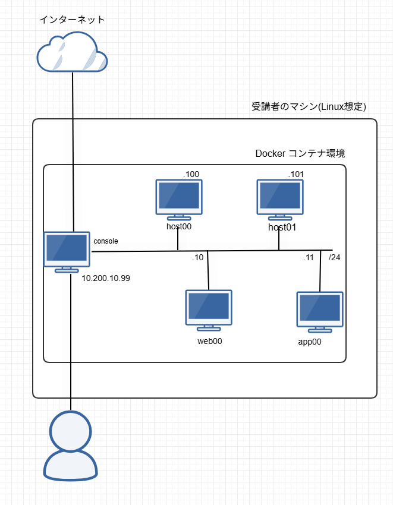

# Ansible Hands-On Materials

## Overview

このリポジトリは、IIJ Bootcamp の講義「[Ansible による IT 自動化](https://iij.github.io/bootcamp/cicd_infra/ansible/)」講義用教材です。

この講義では本リポジトリを使用して構築する環境を前提に演習を行うため、参加者の方々は以下の作業を実施し、必要な環境を揃えてください。

## Requirements

ハンズオンを実施する上では、以下のセットアップが前提となっています

- Ubuntu 24.04
  - IIJ 社内における Bootcamp 実施時の推奨環境が Ubuntu となっているため
  - これ以外でのディストリビューションでも基本的には動くはずです
- git
  - 導入されていない場合は事前に `sudo apt install git` などでインストールしておいてください
- Docker, Docker Compose
  - Ansible 適用元・適用先ホストの構築のために使用します

## Caution

このハンズオンの実行環境には、以下のような問題点があります。
演習環境の簡略化の為にあえて設定していますが、本来は好ましい設定ではないため、本番環境では適切な設定を行ってください。

- root ユーザによるパスワードでの ssh ログインを許可している
- root パスワードが安直な文字列になっている

## ToDo

それでは演習に必要な環境のセットアップを行います。
以下の一連の作業を実施すると、下記の図に示したような環境が構築されます。

consle コンテナが Ansible 実行元ホスト、それ以外が Ansible 適用先ホストとなるイメージです。
以降、前者を「コンソールコンテナ」後者を「ターゲットコンテナ」と呼称します。



1. Hands-On Materialのダウンロード
   ```sh
   $ git clone https://github.com/iij/ansible-exercise.git
   $ cd ansible-exercise
   ```

1. Docker コンテナ環境の立ち上げ

    ```
    $ docker compose up -d
    ```

1. コンソールコンテナ動作確認
   ```bash
   $ docker compose exec console bash
   [root@ansible_console /]
   # 上記のプロンプトが表示されればOK
   ## Ctrl + D で抜ける
   ```
   他のコンテナとの疎通を確認します。
   ```bash
    [root@ansible_console /]# ping 10.200.10.101 -c 3
    PING 10.200.10.101 (10.200.10.101) 56(84) bytes of data.
    64 bytes from 10.200.10.101: icmp_seq=1 ttl=64 time=0.030 ms
    64 bytes from 10.200.10.101: icmp_seq=2 ttl=64 time=0.031 ms
    64 bytes from 10.200.10.101: icmp_seq=3 ttl=64 time=0.041 ms

    --- 10.200.10.101 ping statistics ---
    3 packets transmitted, 3 received, 0% packet loss, time 2041ms
    rtt min/avg/max/mdev = 0.030/0.034/0.041/0.005 ms
   ```

1. ターゲットコンテナの動作確認

    まずコンソールコンテナに ssh ログインできるか確認します。
    ```
   $ ssh root@10.200.10.99
    The authenticity of host '10.200.10.99 (10.200.10.99)' can't be established.
    ED25519 key fingerprint is SHA256:8mIYyvkyX5UdsrG9t/S3WQGwXrztKJAS1LXb17Rb58Q.
    This key is not known by any other names.
    Are you sure you want to continue connecting (yes/no/[fingerprint])? yes
    ## yes と答えて Enter
    Warning: Permanently added '10.200.10.99' (ED25519) to the list of known hosts.
    root@10.200.10.99's password:   ## パスワードは ansible
    ## 以下のようなプロンプトに変わったらOK
    [root@ansible_console ~]#
    ```

    コンソールコンテナから、他のターゲットコンテナへ ssh ログインできるか確認します。
    ```
    [root@ansible_console ~]# ssh root@ansible_host00
    The authenticity of host 'ansible_host00 (10.200.10.100)' can't be established.
    ED25519 key fingerprint is SHA256:WaNCmS95atQrn+Qv+05RGtkabxgqegpQ7ibQJwUHlsA.
    This host key is known by the following other names/addresses:
        ~/.ssh/known_hosts:1: 10.200.10.10
    Are you sure you want to continue connecting (yes/no/[fingerprint])? yes
    ## yes と答えて Enter
    Warning: Permanently added 'ansible_host00' (ED25519) to the list of known hosts.
    root@ansible_host00's password: ## パスワードは ansible
    ## 以下のようなプロンプトに変わったらOK
    [root@ansible_host00 ~]#
    ```
    特に問題がなければ、この確認は1つのコンテナだけでOKです。

## Recommended

このハンズオンでの推奨環境として`Visual Studio Code`(以下、VS Code)を指定します。
ソースコードエディタや開発環境に特にこだわりがない人は、以下の環境を整えておくとスムーズにハンズオンを進めることができます。

### VS Code

VS Code とはマイクロソフトが開発したオープンソースのソースコードエディタです。
拡張機能(extension)をインストールすることで様々な言語のソースコードを効率よく編集することができます。

[公式サイト](https://code.visualstudio.com/)から環境に合わせてインストールしましょう。

なお、本リポジトリの `/ansible` ディレクトリを VSCode で開くことで、Playbook 等を快適に編集できるようになります。

#### Ansible Extension

VS Code にはRed Hat社よりAnsibleのplaybookを書く為に公式の Extension が提供されています。
補完や構文チェックなどの機能が備わっているため、使用することをおすすめします。

[公式サイト](https://marketplace.visualstudio.com/items?itemName=redhat.ansible)
