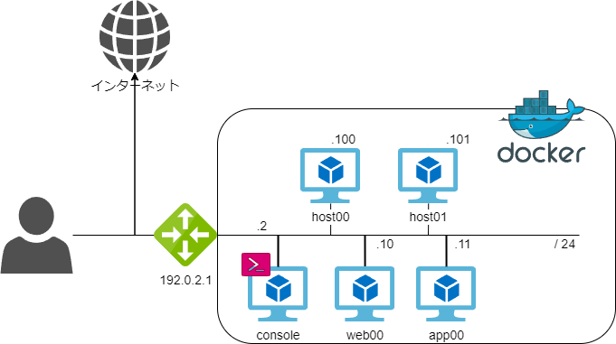

## Ansible Hands-On 講義資料

### はじめに

本リポジトリは、IIJ Bootcamp Ansible ハンズオンの演習用教材です。
このハンズオンでは、Ansible を使ったサーバー設定の自動化を体験します。
最終的には、Webアプリケーションが動作する環境をゼロからコードで構築することを目指します。

講義は、本資料で示す環境が準備できていることを前提に進めます。
参加者の方は、以下の手順に従って、事前にハンズオン環境のセットアップをお願いします。

### 構築する環境



### 必要環境

ハンズオンを開始する前に、PC若しくは演習用の環境に以下のソフトウェアがインストールされていることを確認してください。

- git
- Docker
- Docker Compose

### 演習における推奨開発環境

本ハンズオンでは、開発環境として **Visual Studio Code (VSCode)** と **Dev Containers** 拡張機能の利用を強く推奨します。

- **Visual Studio Code**: 公式サイトからダウンロードできます。

### 注意事項

このハンズオン環境は演習目的のため、本来は推奨されない設定が含まれています。

- Ansibleによる接続がrootユーザ前提となっている
- root ユーザによる SSH ログインを許可 している
- root パスワードが 簡易な文字列 になっている

これらは本番環境で利用するには不適格な為、
本番環境で利用する際には必ず適切なセキュリティ設定を行ってください。

### セットアップ手順

以下の手順を実行すると、図示されたコンテナ環境が構築されます。


#### Hands-On Material のダウンロード

```bash
git clone https://github.com/iij/ansible-exercise.git
```

#### コンテナ環境のセットアップ

```bash
cd ansible-exercise
docker compose up -d
```

#### コンテナの動作・正常性確認

コンソールコンテナにログインします。

```bash
docker exec -it iijbootcamp_ansible_console bash
```

対象コンテナに対して疎通確認を行います。

```bash
ping <対象のコンテナ>
```

- 例: host00へのping

<details><summary>実行結果の例</summary>

```bash
ping iijbootcamp_ansible_host00 -c 3
```
```bash

PING iijbootcamp_ansible_host00 (192.0.2.100) 56(84) bytes of data.
64 bytes from iijbootcamp_ansible_host00.ansible-exercise_vm_net (192.0.2.100): icmp_seq=1 ttl=64 time=0.115 ms
64 bytes from iijbootcamp_ansible_host00.ansible-exercise_vm_net (192.0.2.100): icmp_seq=2 ttl=64 time=0.084 ms
64 bytes from iijbootcamp_ansible_host00.ansible-exercise_vm_net (192.0.2.100): icmp_seq=3 ttl=64 time=0.082 ms
```

</details>

#### 各コンテナへのSSH接続確認

次に、SSHでログインできることを確認します。

- iijbootcamp_ansible_host00
- iijbootcamp_ansible_host01
- iijbootcamp_ansible_web00
- iijbootcamp_ansible_app00

- **コマンド**: `ssh <対象のコンテナ名>`
- **パスワード**: `ansible`

初回接続時には、接続先のホストのフィンガープリントを信頼するか尋ねられます。`yes` と入力して Enter キーを押してください。

<details><summary>実行例: host00へのSSH接続</summary>

```bash
[root@ansible_console /ansible]# ssh iijbootcamp_ansible_host00
The authenticity of host 'iijbootcamp_ansible_host00 (192.0.2.100)' can't be established.
ED25519 key fingerprint is SHA256:xxxxxxxxxxxxxxxxxxxxxxxxxxxxxxxxxxxxxxxxxxx.
Are you sure you want to continue connecting (yes/no/[fingerprint])? yes
Warning: Permanently added 'iijbootcamp_ansible_host00' (ED25519) to the list of known hosts.
root@iijbootcamp_ansible_host00's password:
[root@ansible_host00 ~]#
```
`[root@ansible_host00 ~]#` のように、プロンプトが対象コンテナのものに変わればログイン成功です。
`exit` コマンドで `console` コンテナに戻れます。
</details>

### トラブルシューティング (よくある質問)

#### Q. Dockerイメージが取得できない
**A.** 社内ネットワークなど、プロキシ経由でのインターネット接続が必要な環境では、Dockerのプロキシ設定が必要な場合があります。お使いの環境に合わせて、Docker Desktopの「Settings」>「Resources」>「Proxies」から設定を行ってください。

#### Q. コンテナ間でSSH接続ができない
**A.** お使いのPCのセキュリティ機能（SELinux, AppArmor, ファイアウォールなど）がコンテナ間の通信をブロックしている可能性があります。一時的にこれらの機能を無効にして試すか、適切な許可ルールを追加してください。
